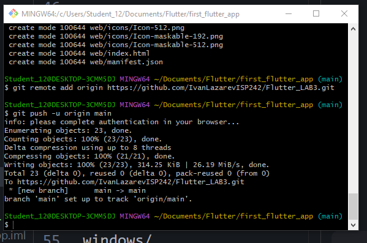

# first_flutter_app

Flutter. Лабораторная работа 3

## Getting Started

Изучение основ Flutter  и создания веб-приложений.

Лазарев Иван ИСП-242

Flutter 3.47.1
Dart 3.13.1
Web(Chrome)
IDE: VS Code

## Запуск
Клонировать репозиторий
Перейти в папку проекта
Выполнить `flutter pub get`
Запустить командой `flutter run -d chrome`

изучил основы написания веб-приложений и их оформление.

- [Learn Flutter](https://docs.flutter.dev/get-started/learn-flutter)
- [Write your first Flutter app](https://docs.flutter.dev/get-started/codelab)
- [Flutter learning resources](https://docs.flutter.dev/reference/learning-resources)

For help getting started with Flutter development, view the
[online documentation](https://docs.flutter.dev/), which offers tutorials,
samples, guidance on mobile development, and a full API reference.
